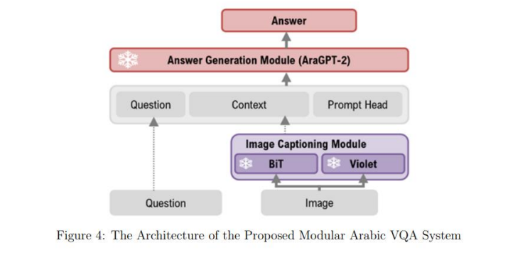
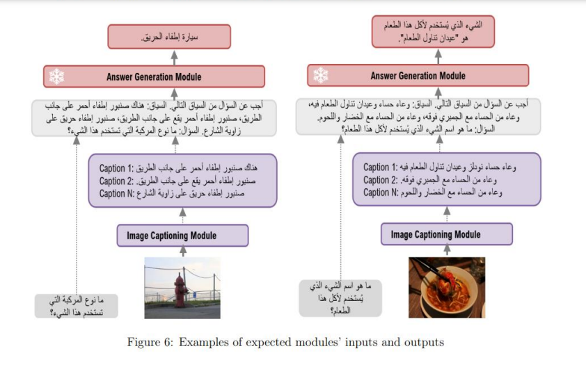

# Arabic Visual Question Answering

[](https://colab.research.google.com/github/shahadMAlshalawi/Modular-Arabic-VQA/blob/main/notebooks/gemini_experiments.ipynb)
[](https://colab.research.google.com/github/shahadMAlshalawi/Modular-Arabic-VQA/blob/main/notebooks/aragpt2_experiments.ipynb)

<p align="center">
  
</p>

<p align="center">
  
</p>


## Overview

**Modular Arabic Visual Question Answering System (aravqa)** is a modular and extensible framework designed for answering open-ended questions about images in Arabic. It combines multiple state-of-the-art pretrained models for image captioning, language processing, and evaluation metrics, offering a seamless pipeline to generate insights and conduct experiments.

## Key Features:
- **Modularity:** Plug-and-play architecture for adding and customizing models.
- **Arabic Support:** Designed to handle Arabic datasets and language processing tasks.
- **Flexible Configuration:** Supports various captioning models, caption selection strategies, and evaluation metrics.
- **Experimentation-Friendly:** Provides a robust pipeline for experiments, including ablation studies and performance evaluation.


## Installation

#### Option 1: Install via `pip`
```bash
pip install git+https://github.com/shahadMAlshalawi/Modular-Arabic-VQA.git --quiet
```
#### Option 2: Clone Repository and Install in Editable Mode
```bash
git clone https://github.com/shahadMAlshalawi/Modular-Arabic-VQA.git
cd Modular-Arabic-VQA
pip install -e .
```
### Option 3: Use Conda Environment
```bash 
git clone https://github.com/shahadMAlshalawi/Modular-Arabic-VQA.git
cd Modular-Arabic-VQA
conda env create -f environment.yml
conda activate aravqa
pip install -e .
```

## Architecture

The aravqa framework is structured into multiple reusable modules, allowing customization and extensibility:

- **Core:** Contains shared utilities and configurations.

- **Datasets:** Manages dataset loading, processing, and preparation.

- **Modules:** Implements various models for captioning and question answering.


## Quick Start


```python 
# Import necessary modules
from aravqa.core.config import Config
from datasets import load_dataset
from aravqa.datasets.utils import prepare_dataset, compute_similarity_captions, compute_bleu_score
from aravqa.datasets import OKVQADataset, OKVQADataLoader
from aravqa.modules.captioning import BiTCaptioner, VioletCaptioner
from aravqa.modules.question_answering import GeminiAnswerer
from aravqa.modules.evaluation import BLEUEvaluator, AccuracyEvaluator
import pandas as pd
import textwrap

# Initialize configuration
config = Config()
config.API_KEY = "your_google_generative_ai_api_key"
config.MODEL_NAME = "models/gemini-1.5-flash"
config.GENERATION_CONFIG = {
    "temperature": 0.0,
    "top_p": 0.95,
    "top_k": 40,
    "max_output_tokens": 20,
    "response_mime_type": "text/plain",
}
config.SYSTEM_INSTRUCTION = textwrap.dedent("""
    You are a highly capable language model specialized in answering questions based on provided image captions.
    Your task is to analyze the captions and generate accurate, concise answers in the same language as the question.
    Ensure your response is relevant, clear, and avoids unnecessary details.
""").strip()

config.PROMPT_TEMPLATE = textwrap.dedent("""
    Analyze the following image captions and answer the given question in the same language:
    Captions: {context}
    Question: {question}
    Answer concisely:
""").strip()

# Load datasets
bds = load_dataset(config.BDS_PATH, split=config.SPLIT)
vds = load_dataset(config.VDS_PATH, split=config.SPLIT)

# Prepare datasets
BDS = prepare_dataset(bds, language=config.LANGUAGE)
VDS = prepare_dataset(vds, language=config.LANGUAGE)

# Compute similarities for captions
BDS = compute_similarity_captions(BDS, question_similarity_scorer=compute_bleu_score, answer_similarity_scorer=compute_bleu_score)
VDS = compute_similarity_captions(VDS, question_similarity_scorer=compute_bleu_score, answer_similarity_scorer=compute_bleu_score)

# Combine datasets
dataset = OKVQADataset(BDS, VDS)

# Initialize DataLoader
dataloader = OKVQADataLoader(dataset, config).get_dataloader()

# Initialize LLM Model
llm = GeminiAnswerer(config)

# Generate answers
outputs = llm.generate_from_dataloader(dataloader)
outputs_df = pd.DataFrame.from_dict(outputs)

# Evaluate results
bleu_evaluator = BLEUEvaluator(max_order=2)
accuracy_evaluator = AccuracyEvaluator()

bleu_results = bleu_evaluator.evaluate(predictions=outputs["predictions"], references=outputs["answers"])
accuracy_results = accuracy_evaluator.evaluate(predictions=outputs["predictions"], references=outputs["answers"])

# Display results
print("BLEU Results:", bleu_results)
print("Accuracy Results:", accuracy_results)


```


## Citation

If you use aravqa in your research, please cite the repository:
```
@misc{aravqa,
  author = {Shahad Alshalawi},
  title = {Modular Arabic Visual Question Answering System(aravqa)},
  year = {2025},
  publisher = {GitHub},
  journal = {GitHub repository},
  howpublished = {\url{https://github.com/shahadMAlshalawi/Modular-Arabic-VQA}},
}
```


